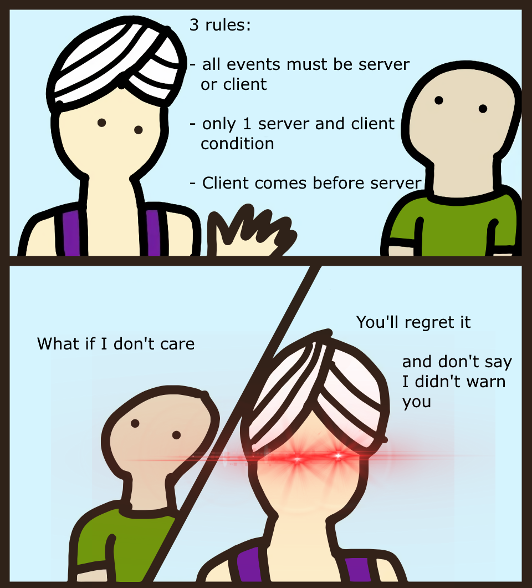

# Creating a THNK scene

THNK doesn't have a lot of requirements for you to create a scene it can work with; All you got to do is separate client code from server code.

:::tip Remember!

**Client code** is the part that players use to interact with the game. Any presentational elements, like the camera, object & layer effects, sprite animations, the music, or interactions with the game, like inputs, menus, HUDs...

**Server code** is the part that defines your game's logic and state, that a hacker should be unable to tamper with. Things like object positions & movement, states of different objects, collisions, player stats, combat damage calculations...

:::

The most basic, valid THNK scene looks like this:

:::tip Remember!

Every THNK scene must respect three rules:

1. Code needs to be under either a client or server condition. Group and comments are fine, but actual events cannot be
2. There can be only 1 server and 1 client code condition. Use sub-events instead of repeating the condition.
3. The client code must always go before the server code.

While it won't break your game immediately to disrespect those rules, they can lead to unexpected behavior and bugs that will be hard for you to diagnose and fix.

:::

Enough lecturing, let's get started creating!
